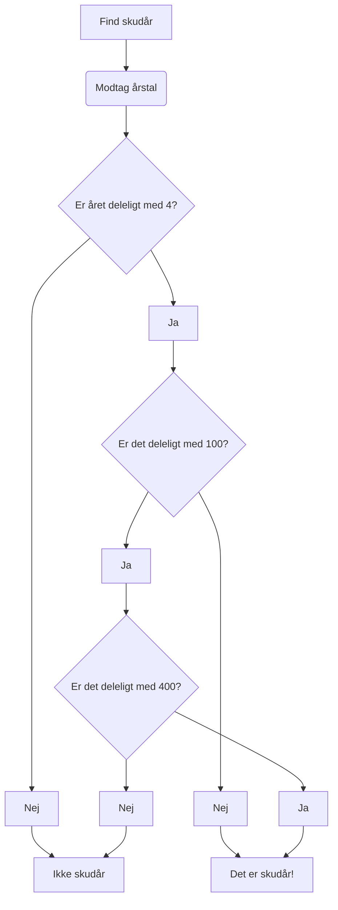

# Arduino Skudår

introduction
hardware
opsætning
biblioteker
flowchart
diagrammer
tools
deployment
kontakt info

### Programmets intro:
Meningen med programmet er at finde ud af hvorfor et givent år er et skudår eller ej.

---
### Hardware:
Til dette projekt er der brugt en ATMega2560 samt en Atmel programmer (og 2 x 220 Ohm modstande + to lysdioder)

---
### Opsætning:
De to dioder er defineret til at grøn er på pin 5, og rød er på pin 7.
220 Ohm modstand mellem output pin og anoden på dioden.

---
### Flowchart:

---
### Tools:
- Microchip Studio 7 
- Arduino IDE

---
### Kontakt:
- Main developer
-- Jan Andreasen
-- jan@tved.it
---
