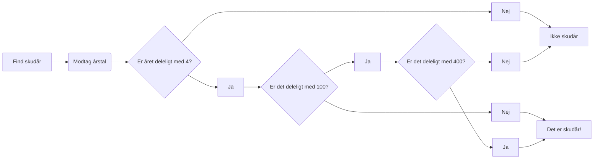

# Arduino Skudår

### Programmets struktur:
Meningen med programmet er at finde ud af hvorfor et givent år er et skudår eller ej.
- Er året deleligt med 4?
- Er det i så fald deleligt med 100?
- Hvis ikke, er det deleligt med 400?
-- *(se flowchart)*

#### Metoder i programmet:
Udover setup() og loop() er der også en metode der kontrollerer om resultatet er true eller false.
CalculateLeap() modtager en integer (året) og vil vha. et par if-statements returnere enten en true eller false alt efter om året er et skudår eller ej.

I loop() metoden er der også overvågning af den serielle linie, som søger efter en integer - det input vil blive brugt i *year* variablen, hvis den er større end 0 og ikke er det samme som allerede angivet.

---

Flow chart:

